---
## Front matter
lang: ru-RU
title: Лабораторная работа № 1. Введение в Mininet
subtitle: Моделирование сетей передачи данных
author:
  - Демидова Е. А.
institute:
  - Российский университет дружбы народов, Москва, Россия
date: 12 ноября 2024

## i18n babel
babel-lang: russian
babel-otherlangs: english

## Formatting pdf
toc: false
toc-title: Содержание
slide_level: 2
aspectratio: 169
section-titles: true
theme: metropolis
header-includes:
 - \metroset{progressbar=frametitle,sectionpage=progressbar,numbering=fraction}
---

# Информация

## Докладчик

:::::::::::::: {.columns align=center}
::: {.column width="70%"}

  * Демидова Екатерина Алексеевна
  * студентка группы НКНбд-01-21
  * Российский университет дружбы народов
  * <https://github.com/eademidova>

:::
::: {.column width="30%"}

:::
::::::::::::::

# Введение

**Цель работы**

Основной целью работы является развёртывание в системе виртуализации (например, в VirtualBox) mininet, знакомство с основными командами для работы с Mininet через командную строку и через графический интерфейс.

**Задачи**

1. Настроить стенд виртуальной машины Mininet
2. Освоить основы работы в Mininet

# Выполнение лабораторной работы

## Настройка стенда виртуальной машины Mininet

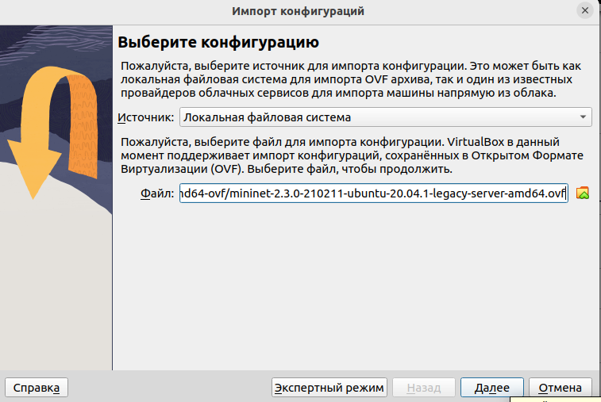{#fig:001 width=70%}

## Настройка стенда виртуальной машины Mininet

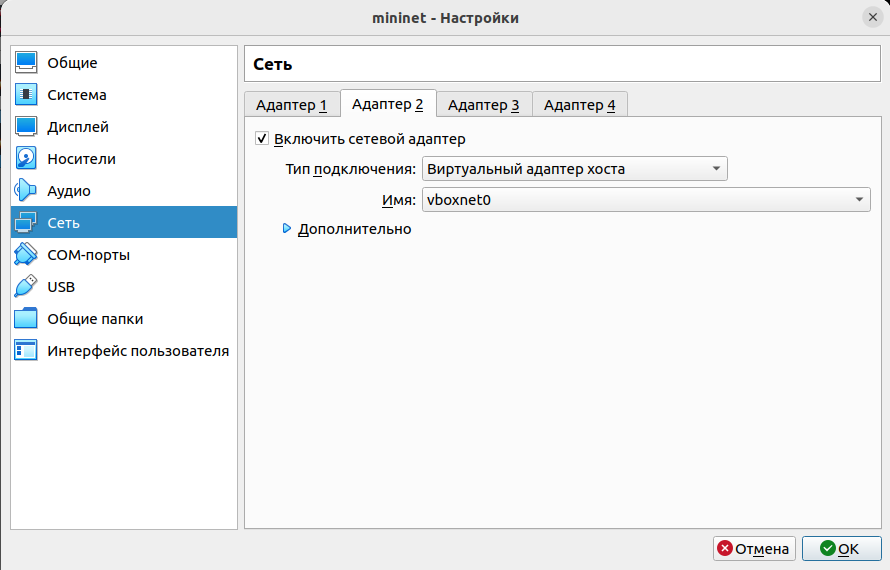{#fig:002 width=70%}

## Настройка стенда виртуальной машины Mininet

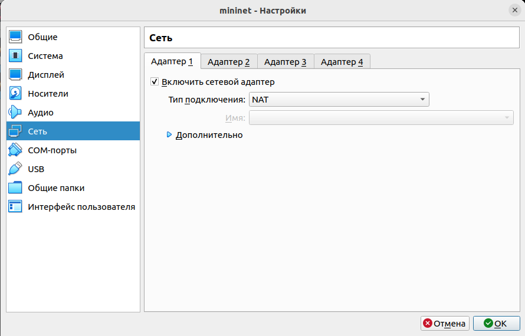{#fig:003 width=70%}

## Настройка стенда виртуальной машины Mininet

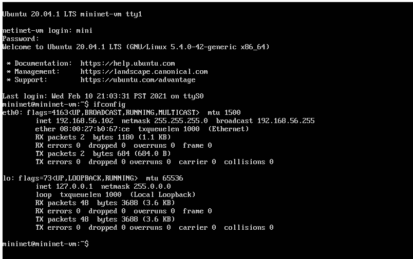{#fig:004 width=70%}

## Настройка стенда виртуальной машины Mininet

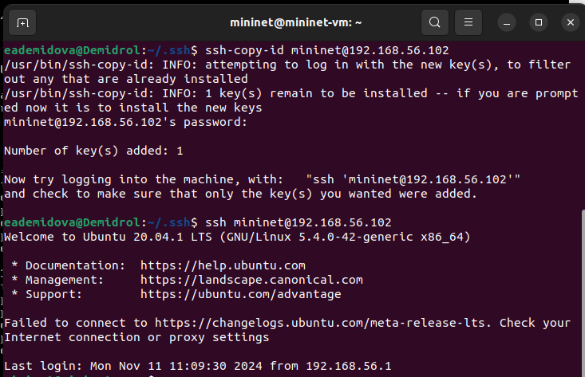{#fig:005 width=70%}

## Настройка стенда виртуальной машины Mininet

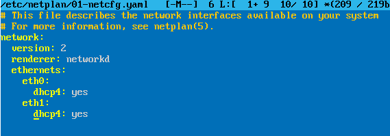{#fig:006 width=70%}

## Настройка стенда виртуальной машины Mininet

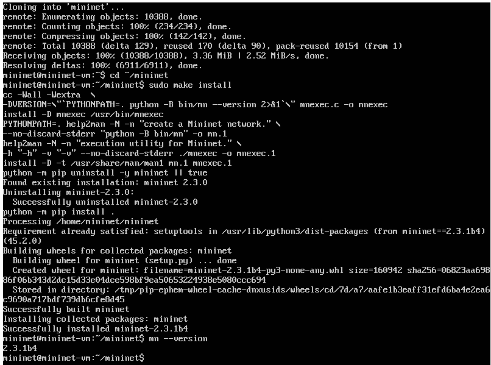{#fig:007 width=50%}

## Настройка стенда виртуальной машины Mininet

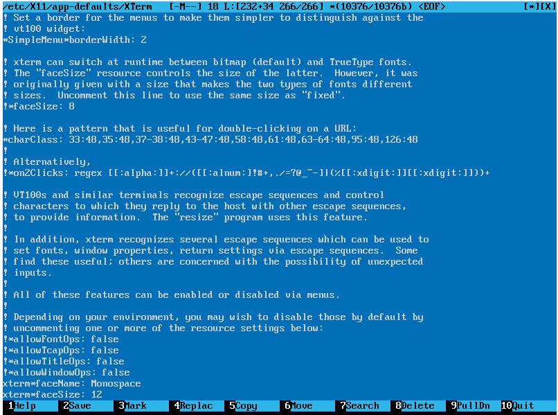{#fig:008 width=50%}

## Настройка стенда виртуальной машины Mininet

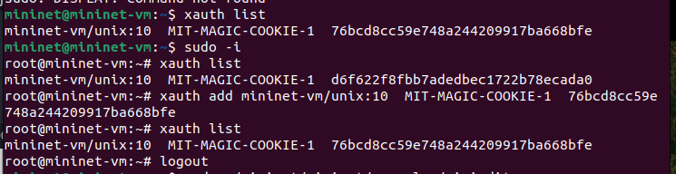{#fig:009 width=70%}

## Основы работы в Mininet

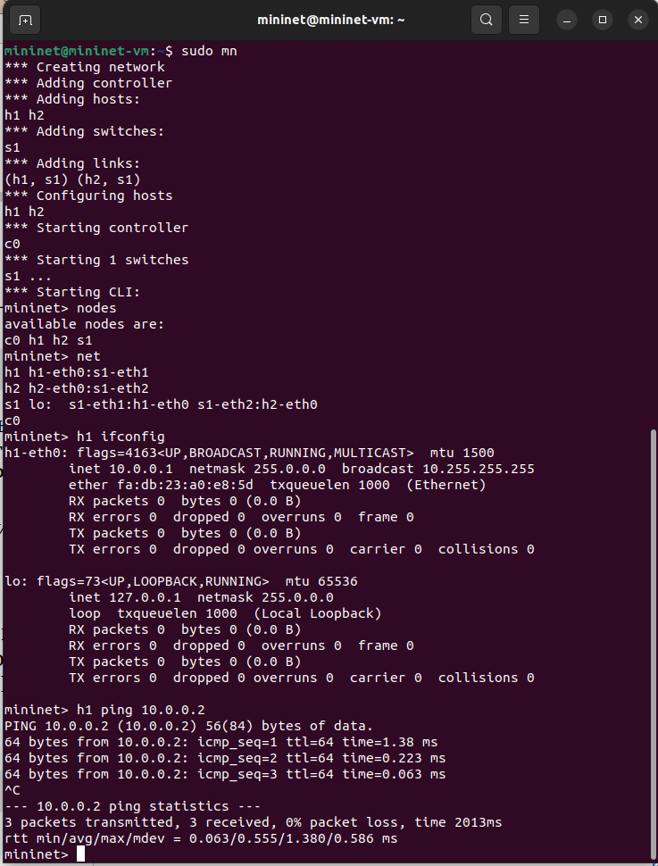{#fig:010 width=50%}

## Построение и эмуляция сети в Mininet с использованием графического интерфейса

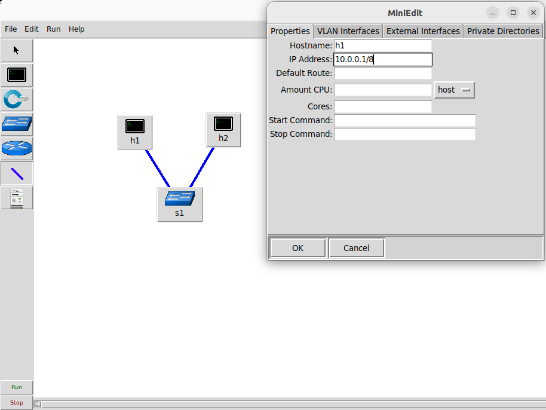{#fig:011 width=50%}

## Построение и эмуляция сети в Mininet с использованием графического интерфейса

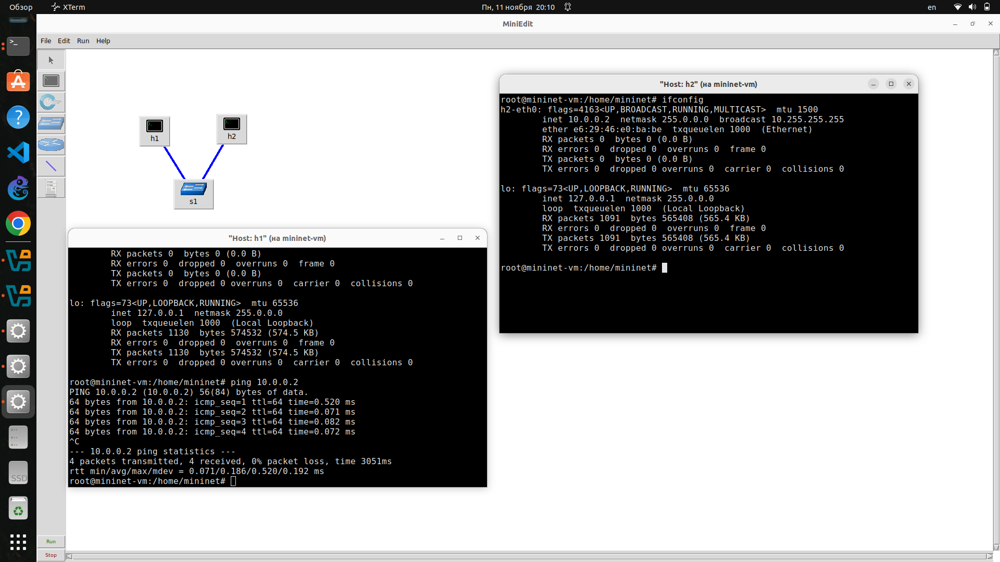{#fig:012 width=70%}

## Построение и эмуляция сети в Mininet с использованием графического интерфейса

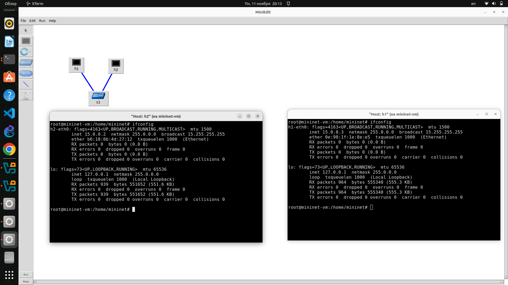{#fig:013 width=70%}

## Построение и эмуляция сети в Mininet с использованием графического интерфейса

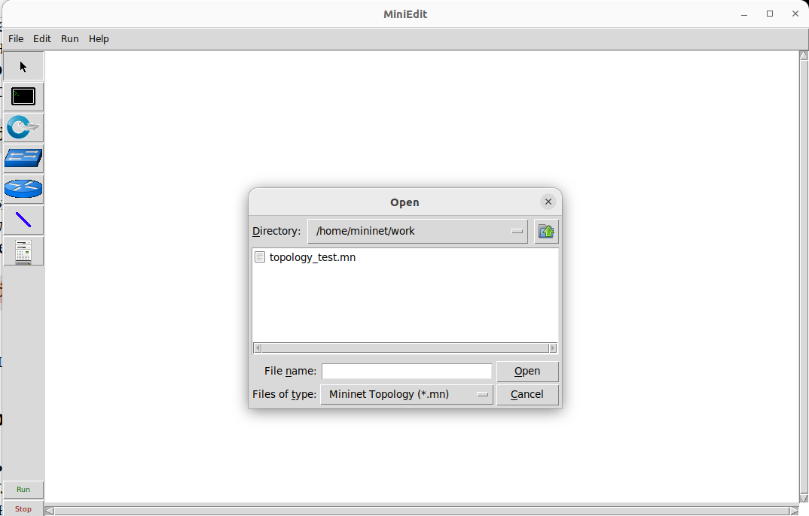{#fig:014 width=70%}

# Выводы

В результате выполнения работы был развёрнут в системе виртуализации  VirtualBox mininet, а также ознакомились с основными командами для работы с Mininet через командную строку и через графический интерфейс.

## Список литературы

1. Mininet [Электронный ресурс]. Mininet Project Contributors. URL: http://mininet.org/ (дата обращения: 11.12.2024).

