---
## Front matter
title: "Моделирование сетей передачи данных"
subtitle: "Лабораторная работа № 2. Измерение и тестирование пропускной способности сети. Интерактивный эксперимент"
author: "Демидова Екатерина Алексеевна"

## Generic otions
lang: ru-RU
toc-title: "Содержание"

## Bibliography
bibliography: bib/cite.bib
csl: pandoc/csl/gost-r-7-0-5-2008-numeric.csl

## Pdf output format
toc: true # Table of contents
toc-depth: 2
lof: true # List of figures
lot: false # List of tables
fontsize: 12pt
linestretch: 1.5
papersize: a4
documentclass: scrreprt
## I18n polyglossia
polyglossia-lang:
  name: russian
  options:
	- spelling=modern
	- babelshorthands=true
polyglossia-otherlangs:
  name: english
## I18n babel
babel-lang: russian
babel-otherlangs: english
## Fonts
mainfont: PT Serif
romanfont: PT Serif
sansfont: PT Sans
monofont: PT Mono
mainfontoptions: Ligatures=TeX
romanfontoptions: Ligatures=TeX
sansfontoptions: Ligatures=TeX,Scale=MatchLowercase
monofontoptions: Scale=MatchLowercase,Scale=0.9
## Biblatex
biblatex: true
biblio-style: "gost-numeric"
biblatexoptions:
  - parentracker=true
  - backend=biber
  - hyperref=auto
  - language=auto
  - autolang=other*
  - citestyle=gost-numeric
## Pandoc-crossref LaTeX customization
figureTitle: "Рис."
tableTitle: "Таблица"
listingTitle: "Листинг"
lofTitle: "Список иллюстраций"
lotTitle: "Список таблиц"
lolTitle: "Листинги"
## Misc options
indent: true
header-includes:
  - \usepackage{indentfirst}
  - \usepackage{float} # keep figures where there are in the text
  - \floatplacement{figure}{H} # keep figures where there are in the text
---

# Введение

**Цель работы**

Основной целью работы является знакомство с инструментом для измерения пропускной способности сети в режиме реального времени -- iPerf3, а также получение навыков проведения интерактивного эксперимента по измерению пропускной способности моделируемой сети в среде Mininet.

**Задачи**

1. Установить на виртуальную машину mininet iPerf3 и дополнительное программное обеспечения для визуализации и обработки данных.
2. Провести ряд интерактивных экспериментов по измерению пропускной способности с помощью iPerf3 с построением графиков.

# Теоретическое введение

Mininet[@mininet] — это эмулятор компьютерной сети. Под компьютерной сетью подразумеваются простые компьютеры — хосты, коммутаторы, а так же OpenFlow-контроллеры. С помощью простейшего синтаксиса в примитивном интерпретаторе команд можно разворачивать сети из произвольного количества хостов, коммутаторов в различных топологиях и все это в рамках одной виртуальной машины(ВМ). На всех хостах можно изменять сетевую конфигурацию, пользоваться стандартными утилитами(ipconfig, ping) и даже получать доступ к терминалу. На коммутаторы можно добавлять различные правила и маршрутизировать трафик.

iPerf3[@iperf]представляет собой кроссплатформенное клиент-серверное приложение с открытым исходным кодом, которое можно использовать для измерения пропускной способности между двумя конечными устройствами. iPerf3 может работать с транспортными протоколами TCP, UDP и SCTP:

- TCP и SCTP:
  - измеряет пропускную способность;
  - позволяет задать размер MSS/MTU;
  - отслеживает размер окна перегрузки TCP (CWnd).
- UDP:
  - измеряет пропускную способность;
  - измеряет потери пакетов;
  - измеряет колебания задержки (jitter);
  - поддерживает групповую рассылку пакетов (multicast).

# Выполнение лабораторной работы

## Установка необходимого программного обеспечения

Проверим есть ли сетевой адрес у виртуальной машины, а затем обновим репозиторий ПО и установим iperf3 и другое необходимое дополнительное ПО(рис. @fig:001)

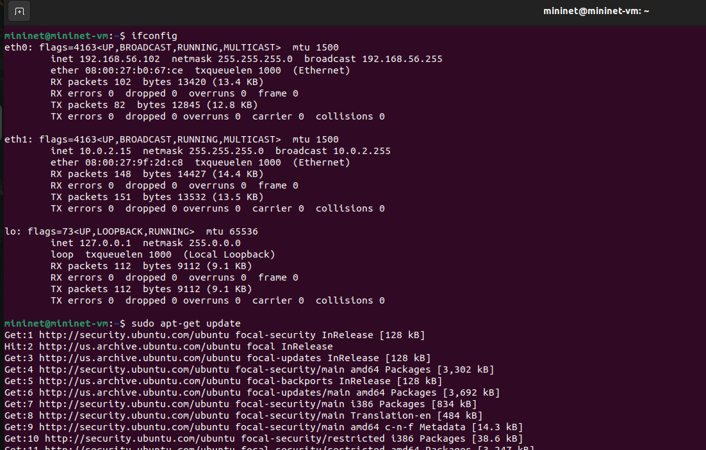{#fig:001 width=70%}

Развернем iperf3_plotter. Для этого перейдем во временный каталог и скачаем репозиторий, а затем скачаем ПО(рис. @fig:002).

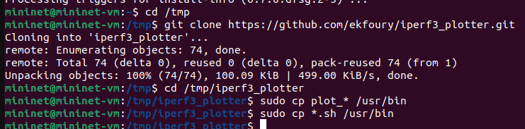{#fig:002 width=70%}

## Интерактивные эксперименты

Запустим простейшую топологию, состоящую из двух хостов и коммутатора с назначенной по умолчанию mininet сетью 10.0.0.0/(рис. @fig:003).

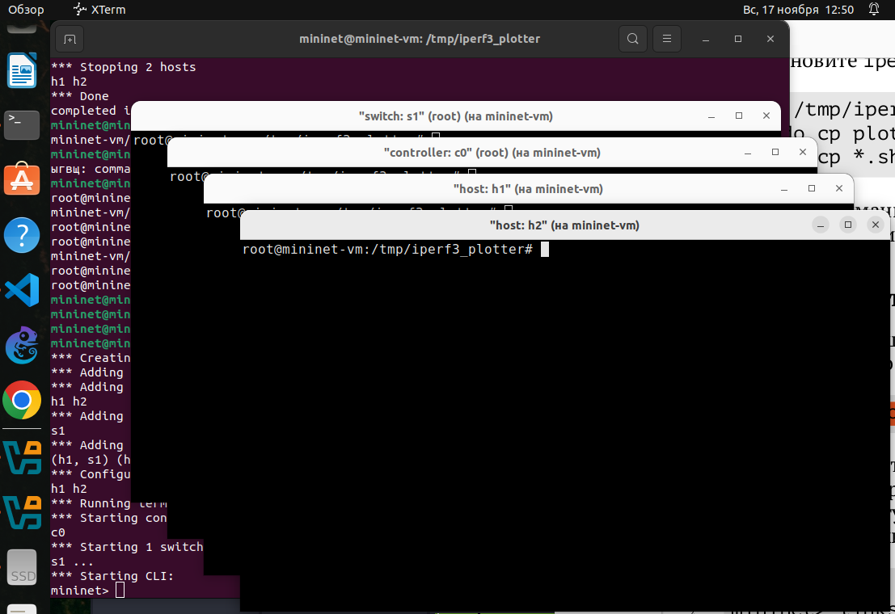{#fig:003 width=70%}

Посмотрим настройки сети(рис. @fig:004).

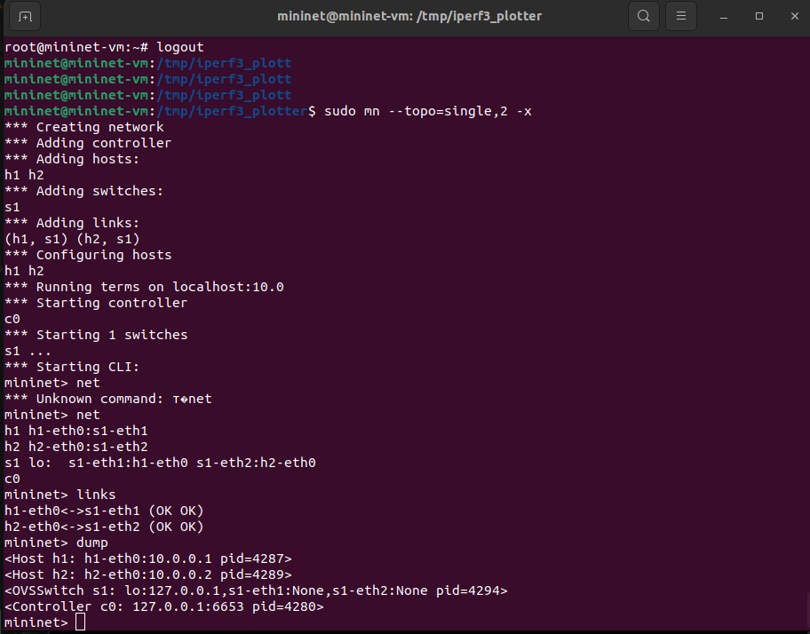{#fig:004 width=70%}

Запустим тестовое соединение между хостами(рис. @fig:005)

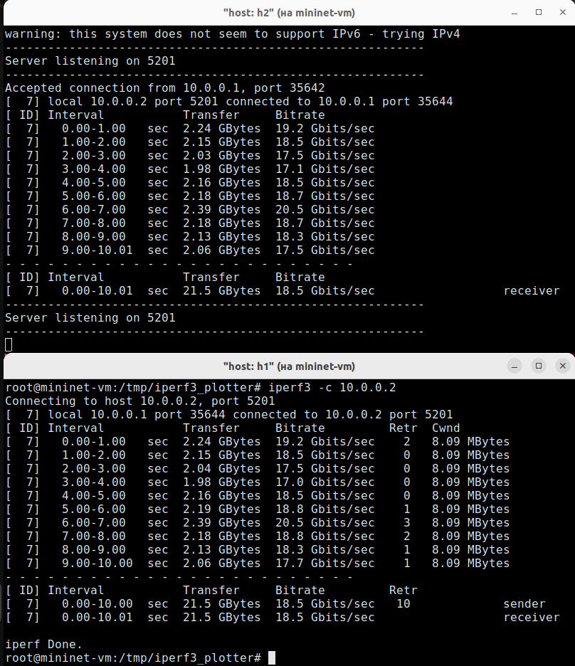{#fig:005 width=70%}

Проанализируем полученный в результате выполнения теста сводный отчёт, отобразившийся как на клиенте, так и на сервере iPerf3. Он содержет следующие данные:
- ID: идентификационный номер соединения -- 7.
- интервал (Interval): временной интервал для периодических отчетов о пропускной способности (по умолчанию временной интервал равен 1 секунде);
- передача (Transfer): сколько данных было передано за каждый интервал времени -- было пепредано от 1.98 до 2.39 GB в секунду;
- пропускная способность (Bitrate): измеренная пропускная способность в каждом временном интервале -- от 17 до 20.5 Gbit/sec;
- Retr: количество повторно переданных TCP-сегментов за каждый временной интервал (это поле увеличивается, когда TCP-сегменты теряются в сети из-за перегрузки или повреждения) -- чем больше пропускная способность, тем больше число повторно переданных  TCP-сегментов. Максимум она достигает 3 при битрейте 20.5 Gbit/sec;
- Cwnd: указывает размер окна перегрузки в каждом временном интервале (TCP использует эту переменную для ограничения объёма данных, которые TCP-клиент может отправить до получения подтверждения отправленных данных) -- это фиксированный параметр равный 8.09 MB.

В концк указан общий вес переданных сообщений и средняя скорость для получателя и отправтеля равнаые 21.5 GB и 18.5 Gbit/sec соответственно, а для отправителя дополнительно указано общее количество повторно отправленных TCP-сегментов равное 10

Проведем аналогичный эксперимент в интерфейсе mininet(рис. @fig:006).

{#fig:006 width=70%}

Сравним результаты. Увидим, что на 0.2 GB меньше было передано, а пропускная способность меньше на 0.2 Gbit/sec, также было на 4 больше повторно отправленных TCP-сегментов.

Для указания iPerf3 периода времени для передачи можно использовать
ключ -t (или --time)(рис. @fig:007).

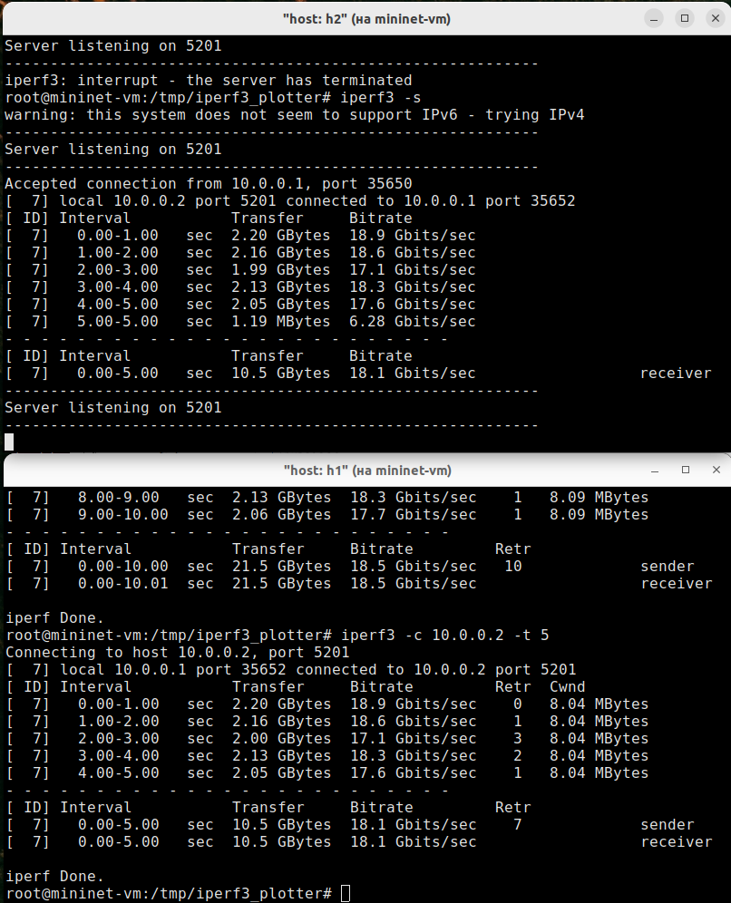{#fig:007 width=70%}

Настроим клиент iPerf3 для выполнения теста пропускной способности с 2-секундным интервалом времени отсчёта как на клиенте, так и на сервере. Используем опцию -i для установки интервала между отсчётами, измеряемого в секундах(рис. @fig:008).

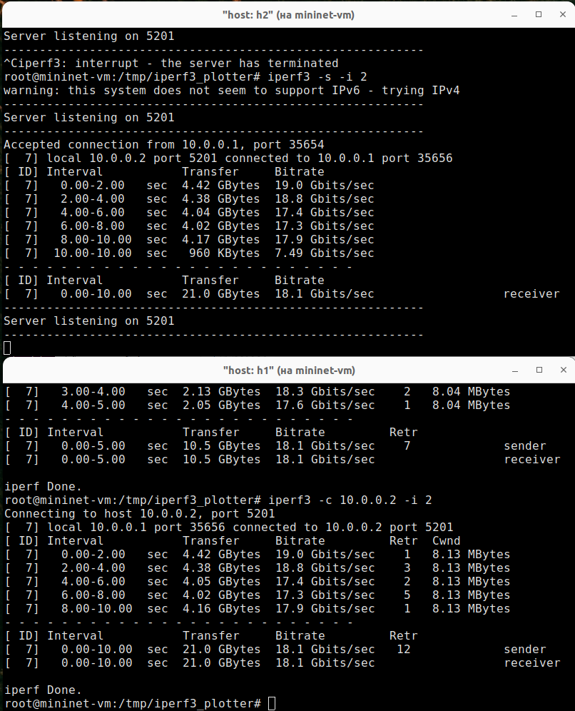{#fig:008 width=70%}

Можно увидеть, что действительно интервал увеличился в два раза, в результате чего в два раза учеличилось также вес переданный за один интервал времени и количество повторно высланных TCP-сегментов, но пропускная способность и суммарные величины очевидно практически не изменились.

Зададим на клиенте iPerf3 отправку определённого объёма данных. Используем опцию -n для установки количества байт для передачи(рис. @fig:009).

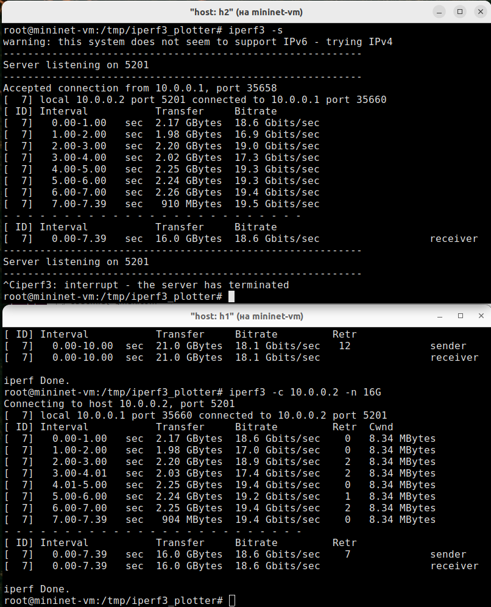{#fig:009 width=70%}

Изменим в тесте измерения пропускной способности iPerf3 протокол передачи данных с TCP (установлен по умолчанию) на UDP. iPerf3 автоматически определяет протокол транспортного уровня на стороне сервера. Для изменения протокола используем опцию -u на стороне клиента iPerf3(рис. @fig:010).

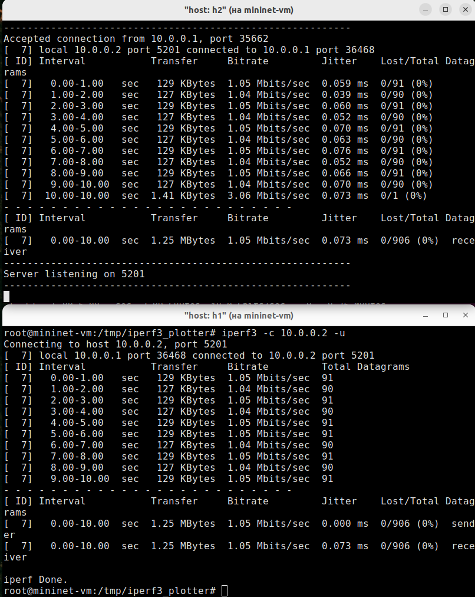{#fig:010 width=70%}

В тесте измерения пропускной способности iPerf3 изменим номер порта для отправки/получения пакетов или датаграмм через указанный порт. Используем для этого опцию -p:(рис. @fig:011)

{#fig:011 width=70%}

По умолчанию после запуска сервер iPerf3 постоянно прослушивает входящие соединения. В тесте измерения пропускной способности iPerf3 зададим для сервера параметр обработки данных только от одного клиента с остановкой сервера по завершении теста. Для этого используем опцию -1 на сервере iPerf3(рис. @fig:012).

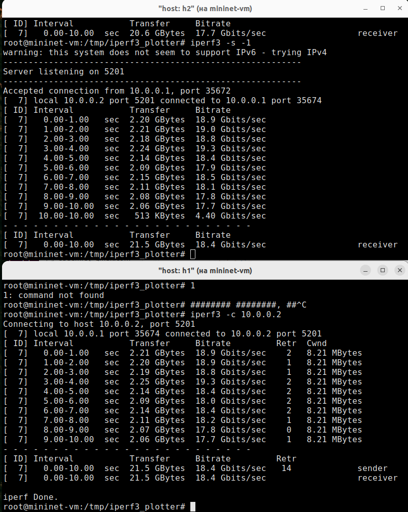{#fig:012 width=70%}

Экспортируем результаты теста измерения пропускной способности iPerf3 в файл JSON(рис. @fig:013).

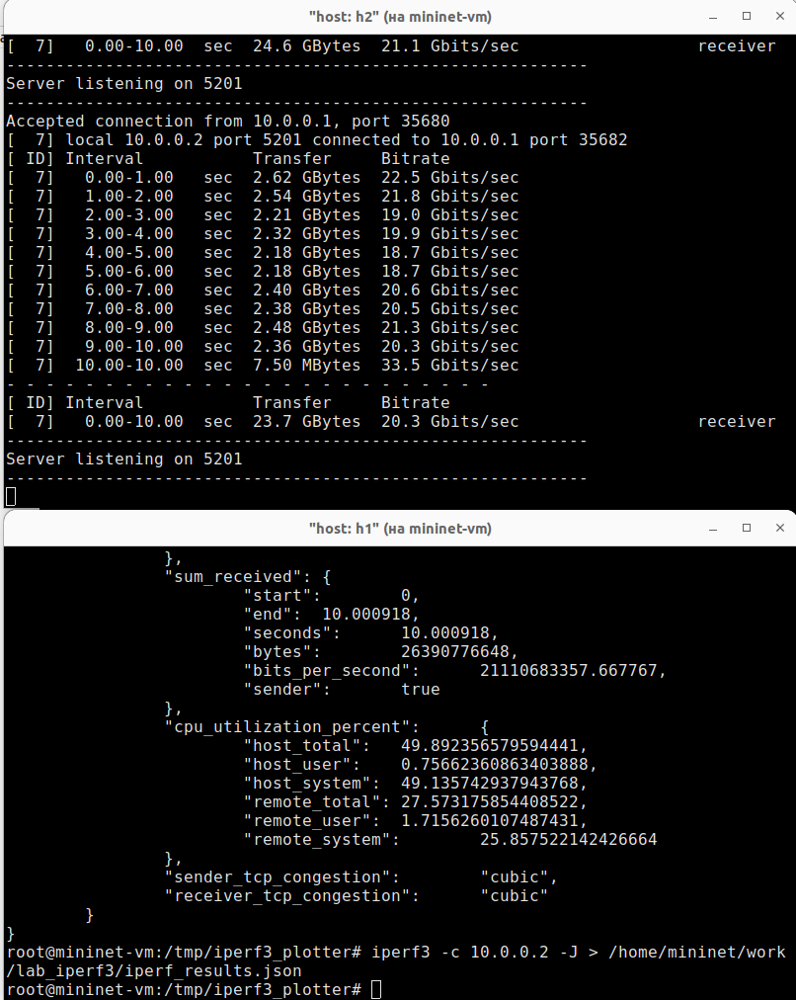{#fig:013 width=70%}

Убедимся, что файл iperf_results.json создан в указанном каталоге. Для этого в терминале хоста h1 введем следующие команды(рис. @fig:014).

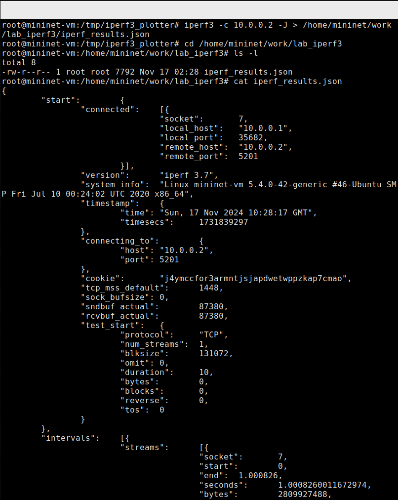{#fig:014 width=70%}

Визуализируем результаты эксперимента. В виртуальной машине mininet перейдем в каталог для работы над проектом, проверим права доступа к файлу JSON. Сгенерируем выходные данные для файла JSON iPerf3. Убедимся, что файлы с данными и графиками сформировались(рис. @fig:015).

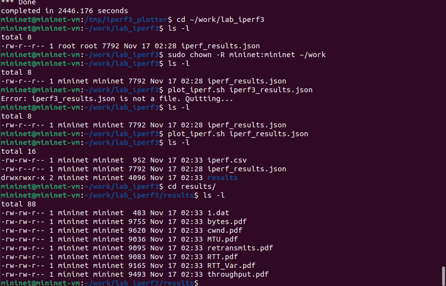{#fig:015 width=70%}

# Выводы

В результате выполнения работы познакомились с инструментом для измерения пропускной способности сети в режиме реального времени -- iPerf3, а также получение навыков проведения интерактивного эксперимента по измерению пропускной способности моделируемой сети в среде Mininet.

# Список литературы{.unnumbered}

::: {#refs}
:::

