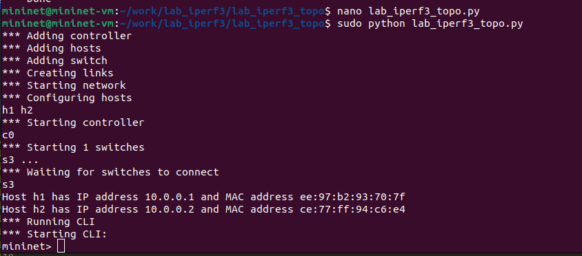

---
## Front matter
lang: ru-RU
title: Лабораторная работа № 3. Измерение и тестирование пропускной способности сети. Воспроизводимый эксперимент
subtitle: Моделирование сетей передачи данных
author:
  - Демидова Е. А.
institute:
  - Российский университет дружбы народов, Москва, Россия
date: 17 ноября 2024

## i18n babel
babel-lang: russian
babel-otherlangs: english

## Formatting pdf
toc: false
toc-title: Содержание
slide_level: 2
aspectratio: 169
section-titles: true
theme: metropolis
header-includes:
 - \metroset{progressbar=frametitle,sectionpage=progressbar,numbering=fraction}
---

# Информация

## Докладчик

:::::::::::::: {.columns align=center}
::: {.column width="70%"}

  * Демидова Екатерина Алексеевна
  * студентка группы НКНбд-01-21
  * Российский университет дружбы народов
  * <https://github.com/eademidova>

:::
::: {.column width="30%"}

:::
::::::::::::::

# Введение

**Цель работы**

Основной целью работы является знакомство с инструментом для измерения пропускной способности сети в режиме реального времени — iPerf3, а также получение навыков проведения воспроизводимого эксперимента по измерению пропускной способности моделируемой сети в среде Mininet.

**Задачи**

1. Воспроизвести посредством API Mininet эксперименты по измерению пропускной способности с помощью iPerf3.
2. Построить графики по проведённому эксперименту.

# Выполнение лабораторной работы

## Создание сети с помощью API Mininet

{#fig:001 width=50%}

## Создание сети с помощью API Mininet

{#fig:002 width=50%}

## Создание сети с помощью API Mininet

{#fig:003 width=70%}

## Создание сети с помощью API Mininet

{#fig:004 width=70%}

## Создание сети с помощью API Mininet

{#fig:005 width=70%}

## Создание сети с помощью API Mininet

{#fig:006 width=50%}

## Создание сети с помощью API Mininet

{#fig:007 width=50%}

## Создание сети с помощью API Mininet

{#fig:008 width=46%}

## Создание сети с помощью API Mininet

{#fig:009 width=70%}

## Создание сети с помощью API Mininet

{#fig:010 width=60%}

# Выводы

В результате выполнения работы познакомились с инструментом для измерения пропускной способности сети в режиме реального времени — iPerf3, а также получение навыков проведения воспроизводимого эксперимента по измерению пропускной способности моделируемой сети в среде Mininet.

## Список литературы

1. Mininet [Электронный ресурс]. Mininet Project Contributors. URL: http://mininet.org/ (дата обращения: 11.12.2024).

2. IPerf [Электронный ресурс]. URL: https://iperf.fr/.

