---
## Front matter
lang: ru-RU
title: Лабораторная работа № 4. Эмуляция и измерение задержек в глобальных сетях
subtitle: Моделирование сетей передачи данных
author:
  - Демидова Е. А.
institute:
  - Российский университет дружбы народов, Москва, Россия
date: 17 ноября 2024

## i18n babel
babel-lang: russian
babel-otherlangs: english

## Formatting pdf
toc: false
toc-title: Содержание
slide_level: 2
aspectratio: 169
section-titles: true
theme: metropolis
header-includes:
 - \metroset{progressbar=frametitle,sectionpage=progressbar,numbering=fraction}
---

# Информация

## Докладчик

:::::::::::::: {.columns align=center}
::: {.column width="70%"}

  * Демидова Екатерина Алексеевна
  * студентка группы НКНбд-01-21
  * Российский университет дружбы народов
  * <https://github.com/eademidova>

:::
::: {.column width="30%"}

:::
::::::::::::::

# Введение

**Цель работы**

Основной целью работы является знакомство с NETEM -- инструментом для тестирования производительности приложений в виртуальной сети, а также получение навыков проведения интерактивного и воспроизводимого экспериментов по измерению задержки и её дрожания (jitter) в моделируемой сети в среде Mininet.

**Задачи**

1. Задайте простейшую топологию.
2. Проведите интерактивные эксперименты по добавлению/изменению задержки, джиттера, значения корреляции для джиттера и задержки, распределения времени задержки в эмулируемой глобальной сети.
3. Реализуйте воспроизводимый эксперимент по заданию значения задержки. Постройте график.

# Выполнение лабораторной работы

## Запуск лабораторной топологии

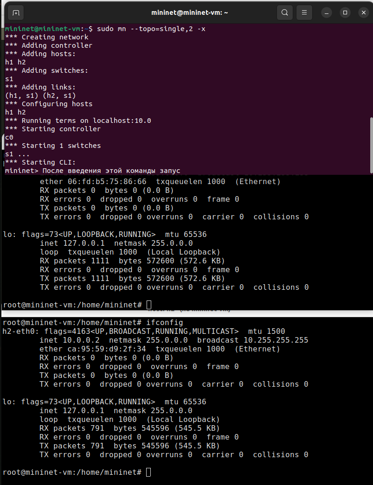{#fig:001 width=35%}

## Запуск лабораторной топологии

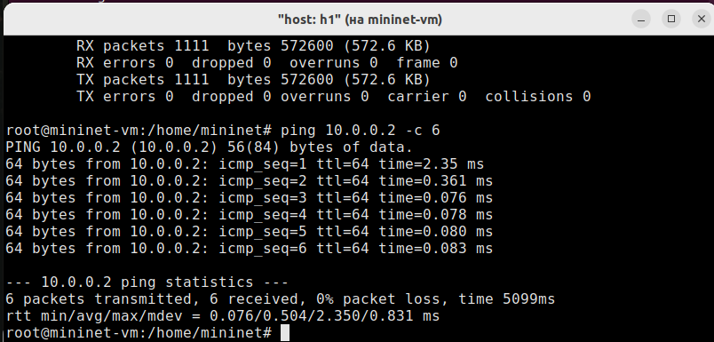{#fig:002 width=70%}

## Добавление/изменение задержки в эмулируемой глобальной сети

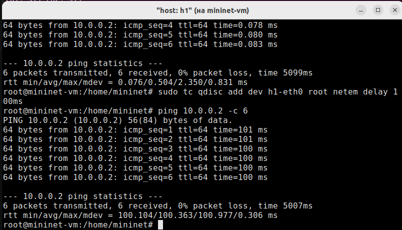{#fig:003 width=70%}

## Добавление/изменение задержки в эмулируемой глобальной сети

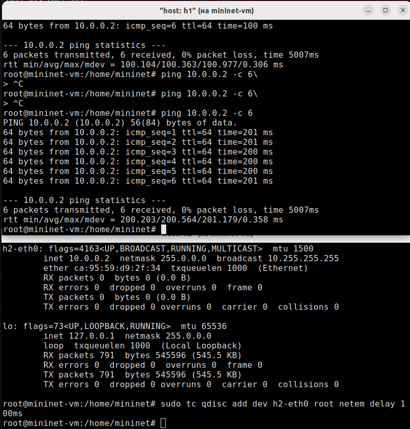{#fig:004 width=35%}

## Изменение задержки в эмулируемой глобальной сети

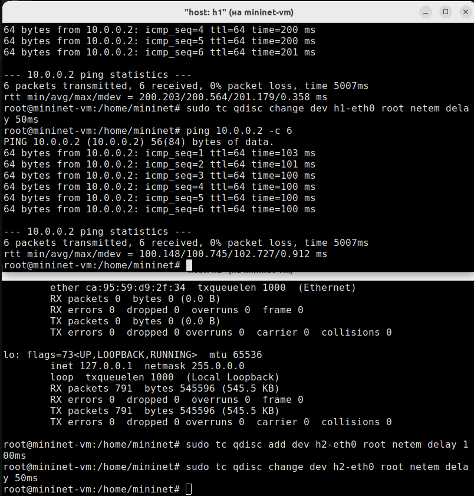{#fig:005 width=35%}

## Восстановление исходных значений (удаление правил) задержки в эмулируемой глобальной сети

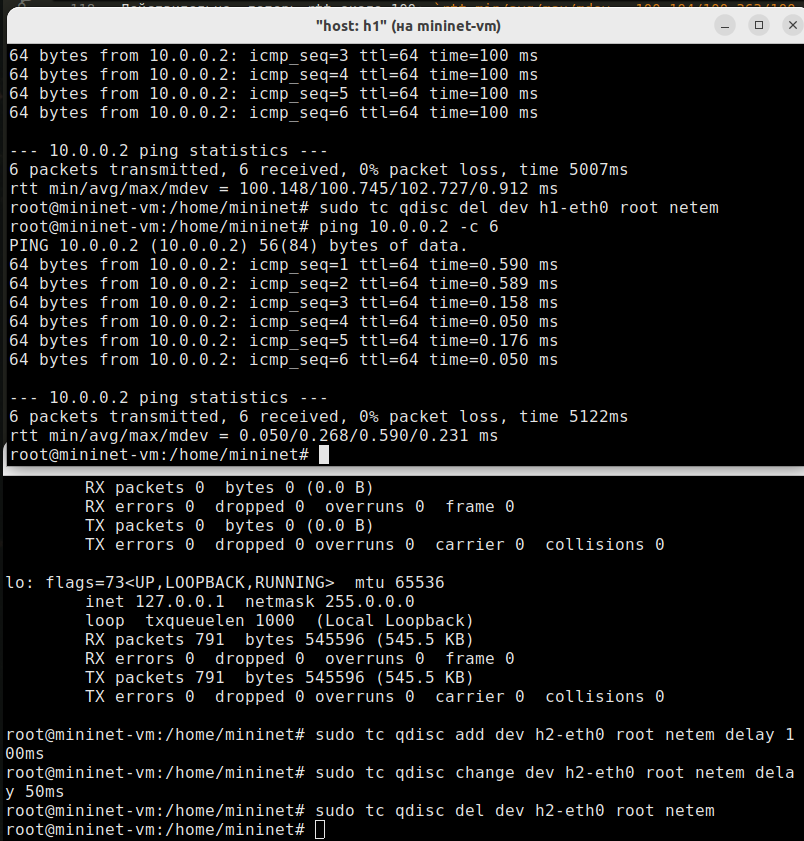{#fig:006 width=35%}

## Добавление значения дрожания задержки в интерфейс подключения к эмулируемой глобальной сети

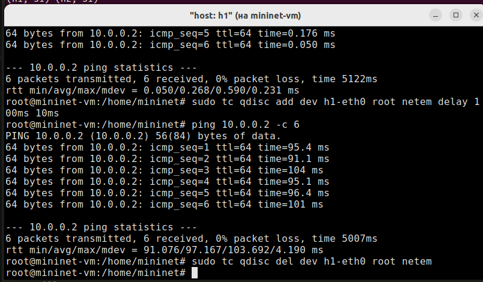{#fig:007 width=70%}

## Добавление значения корреляции для джиттера и задержки в интерфейс подключения к эмулируемой глобальной сети

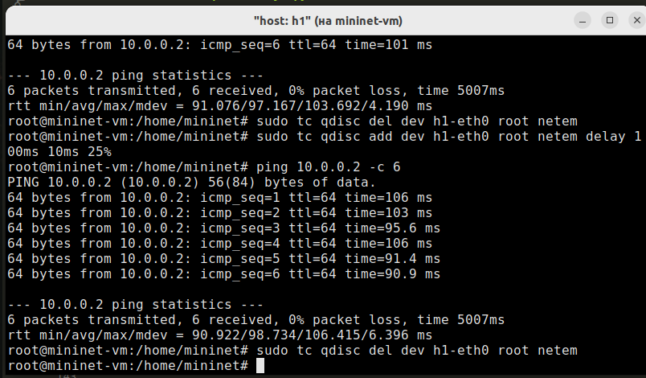{#fig:008 width=70%}

## Распределение задержки в интерфейсе подключения к эмулируемой глобальной сети

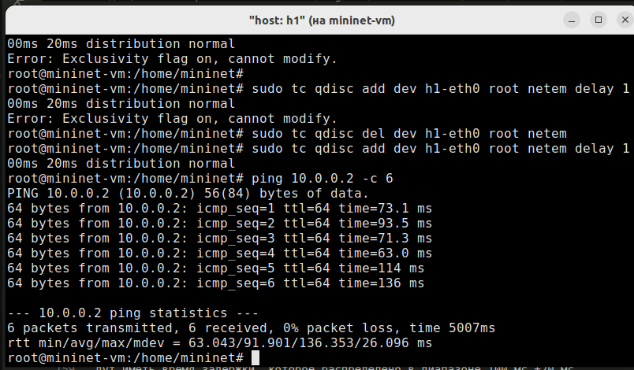{#fig:009 width=70%}

## Воспроизведение экспериментов

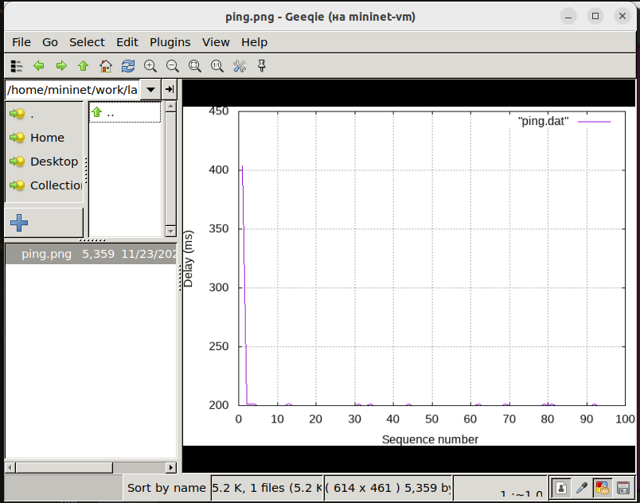{#fig:010 width=35%}

## Воспроизведение экспериментов

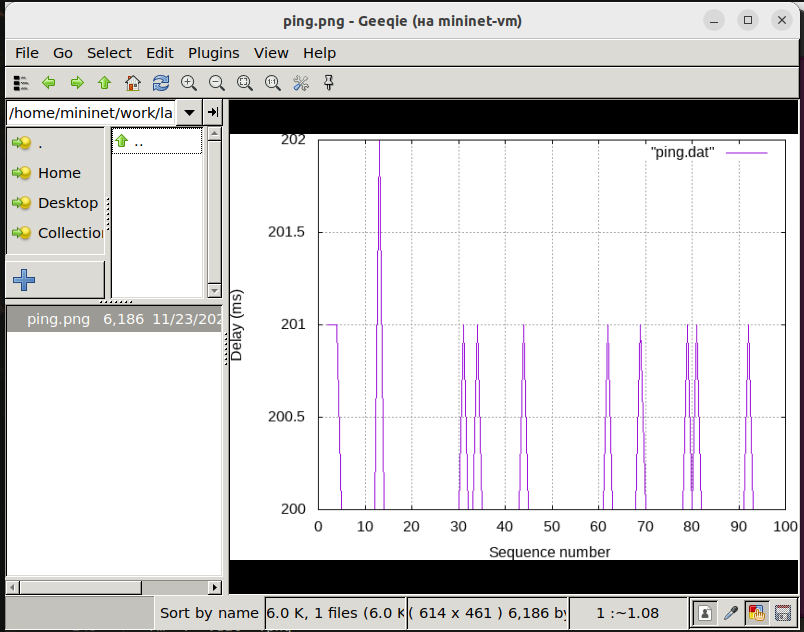{#fig:011 width=35%}

## Воспроизведение экспериментов

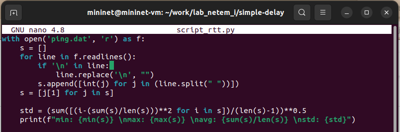{#fig:012 width=70%}

## Воспроизведение экспериментов

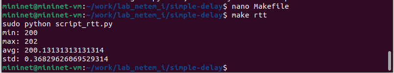{#fig:013 width=70%}

# Выводы

В результате выполнения работы познакомились с NETEM -- инструментом для тестирования производительности приложений в виртуальной сети, а также получbkb навыкb проведения интерактивного и воспроизводимого экспериментов по измерению задержки и её дрожания (jitter) в 

## Список литературы

1. Mininet [Электронный ресурс]. Mininet Project Contributors. URL: http://mininet.org/ (дата обращения: 11.12.2024).
