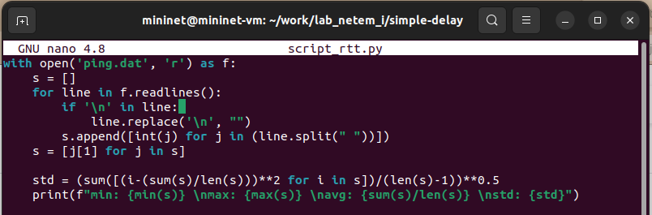

---
## Front matter
title: "Моделирование сетей передачи данных"
subtitle: "Лабораторная работа № 4. Эмуляция и измерение задержек в глобальных сетях"
author: "Демидова Екатерина Алексеевна"

## Generic otions
lang: ru-RU
toc-title: "Содержание"

## Bibliography
bibliography: bib/cite.bib
csl: pandoc/csl/gost-r-7-0-5-2008-numeric.csl

## Pdf output format
toc: true # Table of contents
toc-depth: 2
lof: true # List of figures
lot: false # List of tables
fontsize: 12pt
linestretch: 1.5
papersize: a4
documentclass: scrreprt
## I18n polyglossia
polyglossia-lang:
  name: russian
  options:
	- spelling=modern
	- babelshorthands=true
polyglossia-otherlangs:
  name: english
## I18n babel
babel-lang: russian
babel-otherlangs: english
## Fonts
mainfont: PT Serif
romanfont: PT Serif
sansfont: PT Sans
monofont: PT Mono
mainfontoptions: Ligatures=TeX
romanfontoptions: Ligatures=TeX
sansfontoptions: Ligatures=TeX,Scale=MatchLowercase
monofontoptions: Scale=MatchLowercase,Scale=0.9
## Biblatex
biblatex: true
biblio-style: "gost-numeric"
biblatexoptions:
  - parentracker=true
  - backend=biber
  - hyperref=auto
  - language=auto
  - autolang=other*
  - citestyle=gost-numeric
## Pandoc-crossref LaTeX customization
figureTitle: "Рис."
tableTitle: "Таблица"
listingTitle: "Листинг"
lofTitle: "Список иллюстраций"
lotTitle: "Список таблиц"
lolTitle: "Листинги"
## Misc options
indent: true
header-includes:
  - \usepackage{indentfirst}
  - \usepackage{float} # keep figures where there are in the text
  - \floatplacement{figure}{H} # keep figures where there are in the text
---

# Введение

**Цель работы**

Основной целью работы является знакомство с NETEM -- инструментом для тестирования производительности приложений в виртуальной сети, а также получение навыков проведения интерактивного и воспроизводимого экспериментов по измерению задержки и её дрожания (jitter) в моделируемой сети в среде Mininet.

**Задачи**

1. Задайте простейшую топологию, состоящую из двух хостов и коммутатора с назначенной по умолчанию mininet сетью 10.0.0.0/8.
2. Проведите интерактивные эксперименты по добавлению/изменению задержки, джиттера, значения корреляции для джиттера и задержки, распределения времени задержки в эмулируемой глобальной сети.
3. Реализуйте воспроизводимый эксперимент по заданию значения задержкив эмулируемой глобальной сети. Постройте график.
4. Самостоятельно реализуйте воспроизводимые эксперименты по изменению задержки, джиттера, значения корреляции для джиттера и задержки, распределения времени задержки в эмулируемой глобальной сети. Постройте графики.

# Теоретическое введение

Mininet[@mininet] — это эмулятор компьютерной сети. Под компьютерной сетью подразумеваются простые компьютеры — хосты, коммутаторы, а так же OpenFlow-контроллеры. С помощью простейшего синтаксиса в примитивном интерпретаторе команд можно разворачивать сети из произвольного количества хостов, коммутаторов в различных топологиях и все это в рамках одной виртуальной машины(ВМ). На всех хостах можно изменять сетевую конфигурацию, пользоваться стандартными утилитами(ipconfig, ping) и даже получать доступ к терминалу. На коммутаторы можно добавлять различные правила и маршрутизировать трафик.

# Выполнение лабораторной работы

## Запуск лабораторной топологии

Зададим простейшую топологию, состоящую из двух хостов и коммутатора с назначенной по умолчанию mininet сетью 10.0.0.0/8. На хостах h1 и h2 введем команду ifconfig, чтобы отобразить информацию, относящуюся к их сетевым интерфейсам и назначенным им IP-адресам(рис. @fig:001)

{#fig:001 width=70%}

Проверим подключение между хостами сети(рис. @fig:002).

{#fig:002 width=70%}

## Добавление/изменение задержки в эмулируемой глобальной сети

В конце написано минимальное, среднее, максимальное и стандартное отклонение времени приёма-передачи (RTT): `rtt min/avg/max/mdev = 0.076/0.504/2.350/0.831 ms`.

Зададим задержку на хосте h1 и проверим ее наличие(рис. @fig:003).

{#fig:003 width=70%}

Действительно, теперь rtt около 100: `rtt min/avg/max/mdev = 100.104/100.363/100.977/0.306 ms`.

Добавим задержку на хост h2 и увидим, что теперь rtt около 200 `rtt min/avg/max/mdev = 200.203/200.564/201.179/0.358 ms`(рис. @fig:004).

{#fig:004 width=70%}

## Изменение задержки в эмулируемой глобальной сети

Изменим задержку на хостах на 50 мс, при этом у нас `rtt min/avg/max/mdev = 100.148/100.745/102.727/0.912 ms`(рис. @fig:005)

{#fig:005 width=70%}

## Восстановление исходных значений (удаление правил) задержки в эмулируемой глобальной сети

Вернем изначальное значение задержки и проверим корректность изменений `rtt min/avg/max/mdev = 0.050/0.268/0.590/0.231 ms`(рис. @fig:006).

{#fig:006 width=70%}

## Добавление значения дрожания задержки в интерфейс подключения к эмулируемой глобальной сети

Добавим на узле h1 задержку в 100 мс со случайным отклонением 10 мс и проверим изменение(рис. @fig:007).

{#fig:007 width=70%}

ВИдно, что rtt равняется 'rtt min/avg/max/mdev = 91.076/97.167/103.692/4.190 m'.

## Добавление значения корреляции для джиттера и задержки в интерфейс подключения к эмулируемой глобальной сети

Добавим на интерфейсе хоста h1 задержку в 100 мс с вариацией 10 мс и значением корреляции в 25%(рис. @fig:008).

{#fig:008 width=70%}

Убедимся, что все пакеты, покидающие устройство h1 на интерфейсе h1- eth0, будут иметь время задержки 100 мс со случайным отклонением ±10 мс, при этом время передачи следующего пакета зависит от предыдущего значения на 25%: `rtt min/avg/max/mdev = 90.922/98.734/106.415/6.396 ms`.

## Распределение задержки в интерфейсе подключения к эмулируемой глобальной сети

Задайте нормальное распределение задержки на узле h1 в эмулируемой сети(рис. @fig:009).

{#fig:009 width=70%}

Убедимся, что все пакеты, покидающие хост h1 на интерфейсе h1-eth0, будут иметь время задержки, которое распределено в диапазоне 100 мс ±20 мс.

## Воспроизведение экспериментов

В виртуальной среде mininet в своём рабочем каталоге с проектами создадим каталог simple-delay и перейдем в него. Создадим скрипт для эксперимента lab_netem_i.py:

```
#!/usr/bin/env python
"""
Simple experiment.
Output: ping.dat
"""

from mininet.net import Mininet
from mininet.node import Controller
from mininet.cli import CLI

from mininet.log import setLogLevel, info
import time

def emptyNet():

  "Create an empty network and add nodes to it."
  net = Mininet( controller=Controller, waitConnected=True )

  info( '*** Adding controller\n' )
  net.addController( 'c0' )

  info( '*** Adding hosts\n' )
  h1 = net.addHost( 'h1', ip='10.0.0.1' )
  h2 = net.addHost( 'h2', ip='10.0.0.2' )

  info( '*** Adding switch\n' )
  s1 = net.addSwitch( 's1' )

  info( '*** Creating links\n' )
  net.addLink( h1, s1 )
  net.addLink( h2, s1 )

  info( '*** Starting network\n')
  net.start()

  info( '*** Set delay\n')
  h1.cmdPrint( 'tc qdisc add dev h1-eth0 root netem delay 100ms')
  h2.cmdPrint( 'tc qdisc add dev h2-eth0 root netem delay 100ms')

  time.sleep(10) # Wait 10 seconds

  info( '*** Ping\n')
  h1.cmdPrint( 'ping -c 100', h2.IP(), '| grep "time=" | awk \'{print $5, $7}\' | sed -e \'s/time=//g\' -e \'s/icmp_seq=//g\' > ping.dat' )

  info( '*** Stopping network' )
  net.stop()

if __name__ == '__main__':
  setLogLevel( 'info' )
  emptyNet()
```

В этом скрипте создается простейщая топология сети, затем с помощью комнанд, использованных нами ранее задается задержка в 100 мс для обоих хостов, после чего пингуется второй хост(100 сообщений отправляется), при этом из сообщений при пинге вытаскиваются номер сообщения и значение времени, которые записываются в файл с данными.

Создадим также скрипт для визуализации ping_plot результатов эксперимента:

```
#!/usr/bin/gnuplot --persist
set terminal png crop
set output 'ping.png'
set xlabel "Sequence number"
set ylabel "Delay (ms)"
set grid
plot "ping.dat" with lines
```

Создадим Makefile для управления процессом проведения эксперимента:

```
all: ping.dat ping.png

ping.dat:
        sudo python lab_netem_i.py
        sudo chown mininet:mininet ping.dat

ping.png: ping.dat
          ./ping_plot

clean:
  -rm -f *.dat *.png
```


В реузльтате получим график(рис. @fig:010).

{#fig:010 width=70%}

Из файла ping.dat удалим первую строку и заново построим график(рис. @fig:011).

{#fig:011 width=70%}

Разработаем скрипт для вычисления на основе данных файла ping.dat минимального, среднего, максимального и стандартного отклонения времени приёма-передачи. Добавьте правило запуска скрипта в Makefile(рис. @fig:012).

{#fig:012 width=70%}

Запустим скрипт с помощью Makefile(рис. @fig:013).

{#fig:013 width=70%}


# Выводы

В результате выполнения работы познакомились с NETEM -- инструментом для тестирования производительности приложений в виртуальной сети, а также получbkb навыкb проведения интерактивного и воспроизводимого экспериментов по измерению задержки и её дрожания (jitter) в моделируемой сети в среде Mininet.

# Список литературы{.unnumbered}

::: {#refs}
:::


