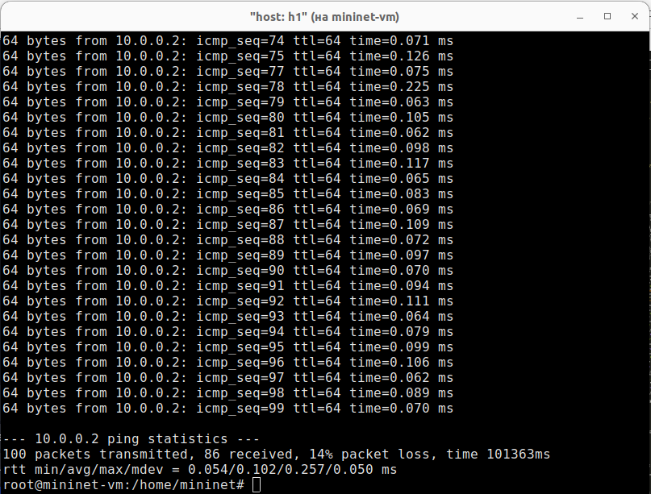

---
## Front matter
lang: ru-RU
title: Лабораторная работа № 5. Эмуляция и измерение потерь пакетов в глобальных сетях
subtitle: Моделирование сетей передачи данных
author:
  - Демидова Е. А.
institute:
  - Российский университет дружбы народов, Москва, Россия
date: 17 ноября 2024

## i18n babel
babel-lang: russian
babel-otherlangs: english

## Formatting pdf
toc: false
toc-title: Содержание
slide_level: 2
aspectratio: 169
section-titles: true
theme: metropolis
header-includes:
 - \metroset{progressbar=frametitle,sectionpage=progressbar,numbering=fraction}
---

# Информация

## Докладчик

:::::::::::::: {.columns align=center}
::: {.column width="70%"}

  * Демидова Екатерина Алексеевна
  * студентка группы НКНбд-01-21
  * Российский университет дружбы народов
  * <https://github.com/eademidova>

:::
::: {.column width="30%"}

:::
::::::::::::::

# Введение

**Цель работы**

Основной целью работы является получение навыков проведения интерактивных экспериментов в среде Mininet по исследованию параметров сети, связанных с потерей, дублированием, изменением порядка и повреждением пакетов при передаче данных. Эти параметры влияют на производительность протоколов и сетей.inet.

**Задачи**

1. Задайте простейшую топологию, состоящую из двух хостов и коммутатора с назначенной по умолчанию mininet сетью 10.0.0.0/8.
2. Проведите интерактивные эксперименты по по исследованию параметров сети, связанных с потерей, дублированием, изменением порядка и повреждением пакетов при передаче данных.
3. Реализуйте воспроизводимый эксперимент по добавлению правила отбрасывания пакетов в эмулируемой глобальной сети. На экран выведите сводную информацию о потерянных пакетах.
4. Самостоятельно реализуйте воспроизводимые эксперименты по исследованию параметров сети

# Выполнение лабораторной работы

## Запуск лабораторной топологии

{#fig:001 width=40%}

## Добавление потери пакетов на интерфейс, подключённый к эмулируемой глобальной сети

{#fig:002 width=50%}

## Добавление потери пакетов на интерфейс, подключённый к эмулируемой глобальной сети

{#fig:003 width=50%}

## Добавление значения корреляции для потери пакетов в эмулируемой глобальной сети

{#fig:004 width=50%}

## Добавление повреждения пакетов в эмулируемой глобальной сети

{#fig:005 width=40%}

## Добавление дублирования пакетов в интерфейс подключения к эмулируемой глобальной сети

{#fig:006 width=50%}

## Воспроизведение экспериментов

{#fig:007 width=60%}

# Выводы

В результате выполнения работы получили навыки проведения интерактивных экспериментов в среде Mininet по исследованию параметров сети, связанных с потерей, дублированием, изменением порядка и повреждением пакетов при передаче данных. Эти параметры влияют на производительность протоколов и сетей.

## Список литературы

1. Mininet [Электронный ресурс]. Mininet Project Contributors. URL: http://mininet.org/ (дата обращения: 11.12.2024).
