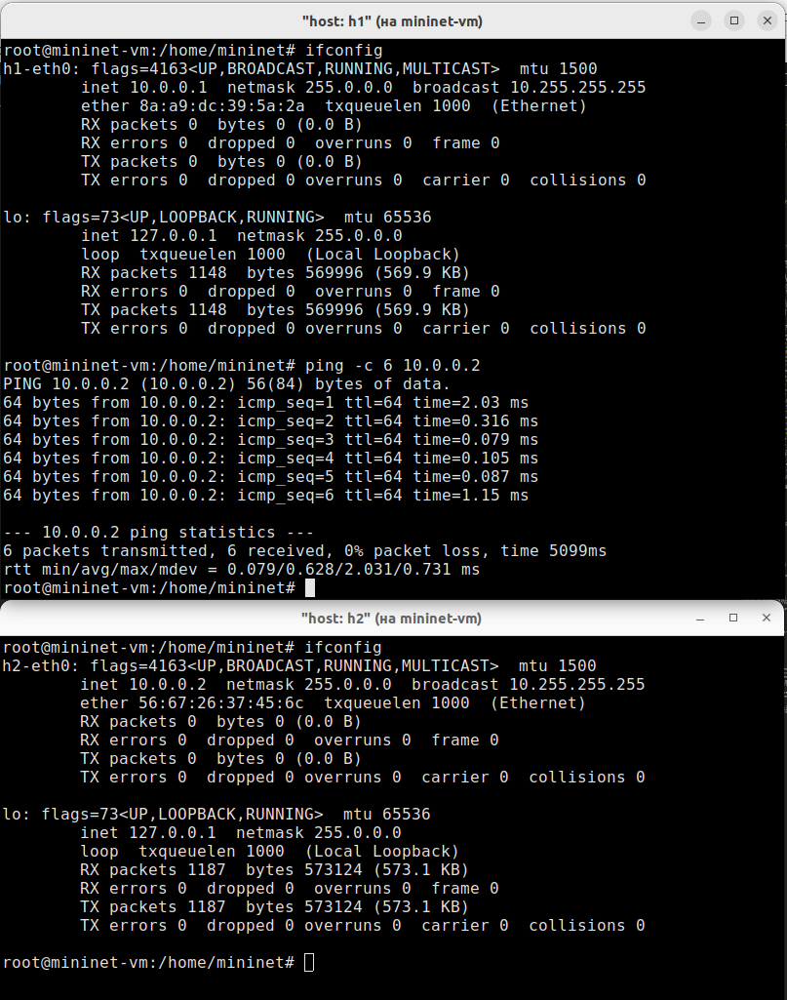
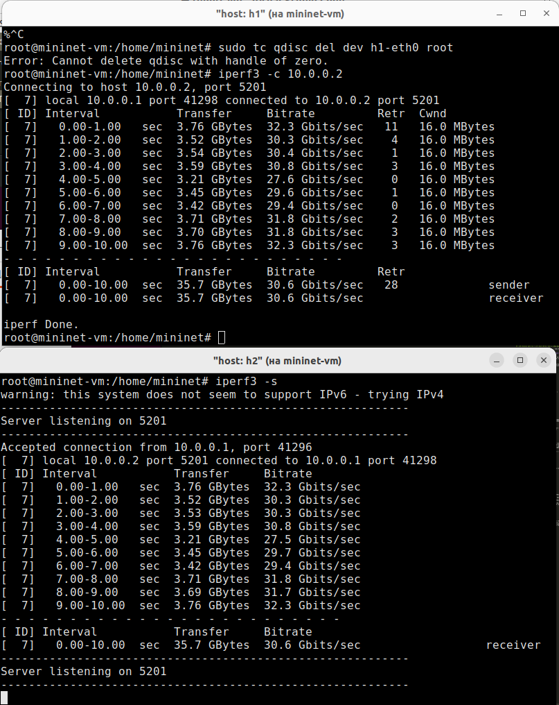
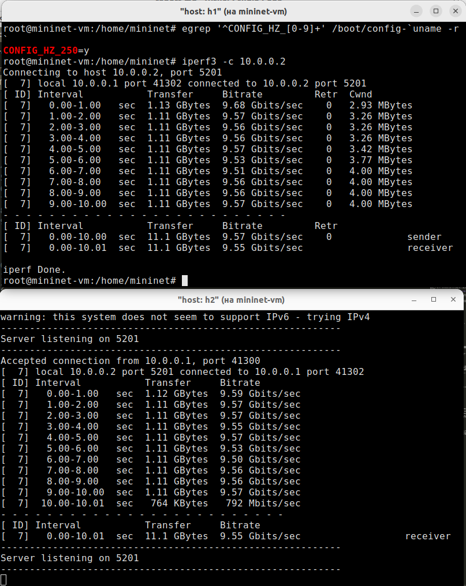
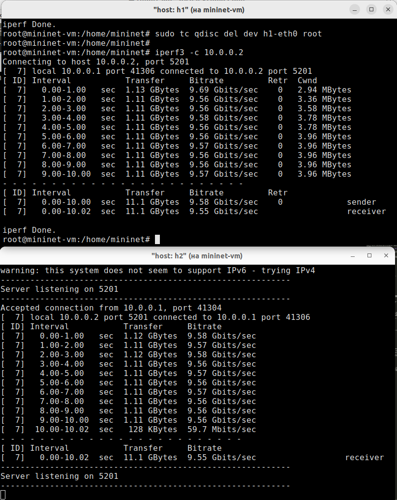
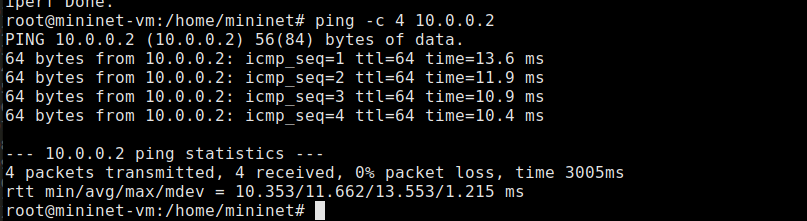
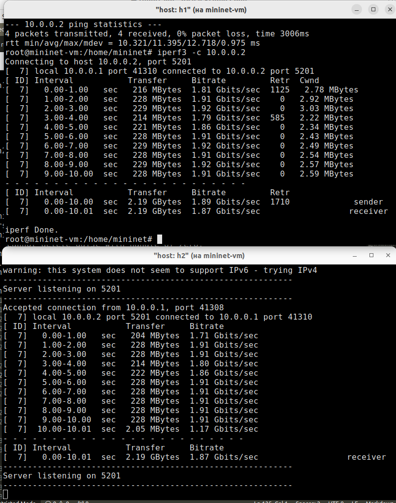
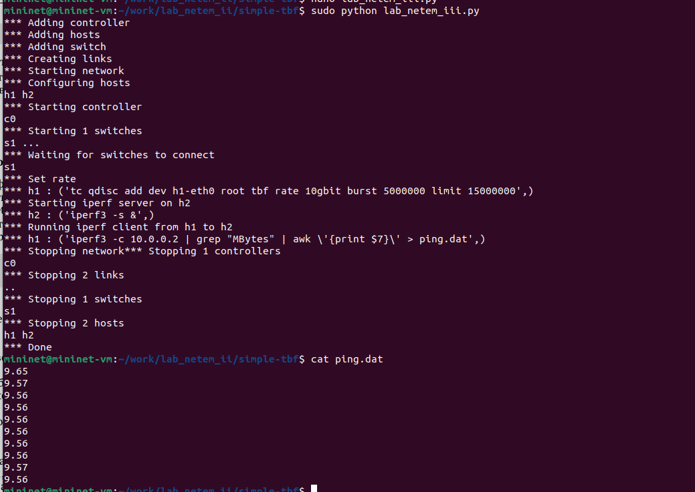
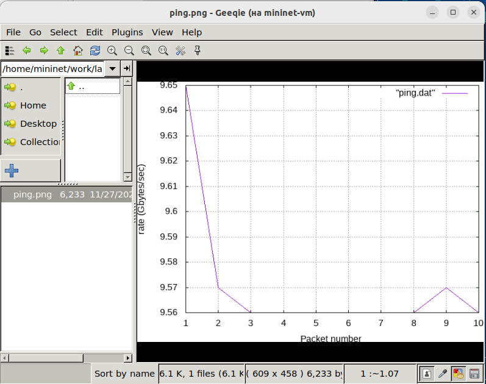

---
## Front matter
lang: ru-RU
title: Лабораторная работа № 6. Настройка пропускной способности глобальной сети с помощью Token Bucket Filter
subtitle: Моделирование сетей передачи данных
author:
  - Демидова Е. А.
institute:
  - Российский университет дружбы народов, Москва, Россия
date: 17 ноября 2024

## i18n babel
babel-lang: russian
babel-otherlangs: english

## Formatting pdf
toc: false
toc-title: Содержание
slide_level: 2
aspectratio: 169
section-titles: true
theme: metropolis
header-includes:
 - \metroset{progressbar=frametitle,sectionpage=progressbar,numbering=fraction}
---

# Информация

## Докладчик

:::::::::::::: {.columns align=center}
::: {.column width="70%"}

  * Демидова Екатерина Алексеевна
  * студентка группы НКНбд-01-21
  * Российский университет дружбы народов
  * <https://github.com/eademidova>

:::
::: {.column width="30%"}

:::
::::::::::::::

# Введение

**Цель работы**

Основной целью работы является знакомство с принципами работы дисциплины очереди Token Bucket Filter, которая формирует входящий/исходящий трафик для ограничения пропускной способности, а также получение навыков моделирования и исследования поведения трафика посредством проведения интерактивного и воспроизводимого экспериментов в Mininet.

**Задачи**

1. Задайте простейшую топологию.
2. Проведите интерактивные эксперименты по ограничению пропускной способности сети с помощью TBF в эмулируемой глобальной сети.
3. Самостоятельно реализуйте воспроизводимые эксперимент по применению TBF для ограничения пропускной способности. Постройте соответствующие графики.

# Выполнение лабораторной работы

## Запуск лабораторной топологии

{#fig:001 width=40%}

## Запуск лабораторной топологии

{#fig:002 width=40%}

## Ограничение скорости на конечных хостах

{#fig:003 width=40%}

## Ограничение скорости на коммутаторах

{#fig:004 width=40%}

## Объединение NETEM и TBF

{#fig:005 width=70%}

## Объединение NETEM и TBF

{#fig:006 width=40%}

## Воспроизведение экспериментов

{#fig:007 width=50%}

## Воспроизведение экспериментов

{#fig:008 width=50%}

# Выводы

В результате выполнения работы познакомились с принципами работы дисциплины очереди Token Bucket Filter, которая формирует входящий/исходящий трафик для ограничения пропускной способности, а также получили навыки моделирования и исследования поведения трафика посредством проведения интерактивного и воспроизводимого экспериментов в Mininet.

## Список литературы

1. Mininet [Электронный ресурс]. Mininet Project Contributors. URL: http://mininet.org/ (дата обращения: 11.12.2024).
